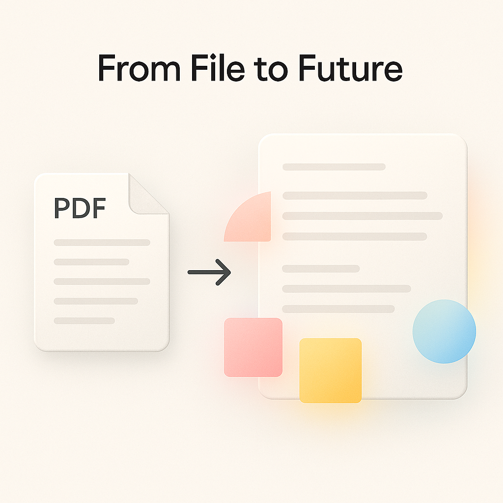
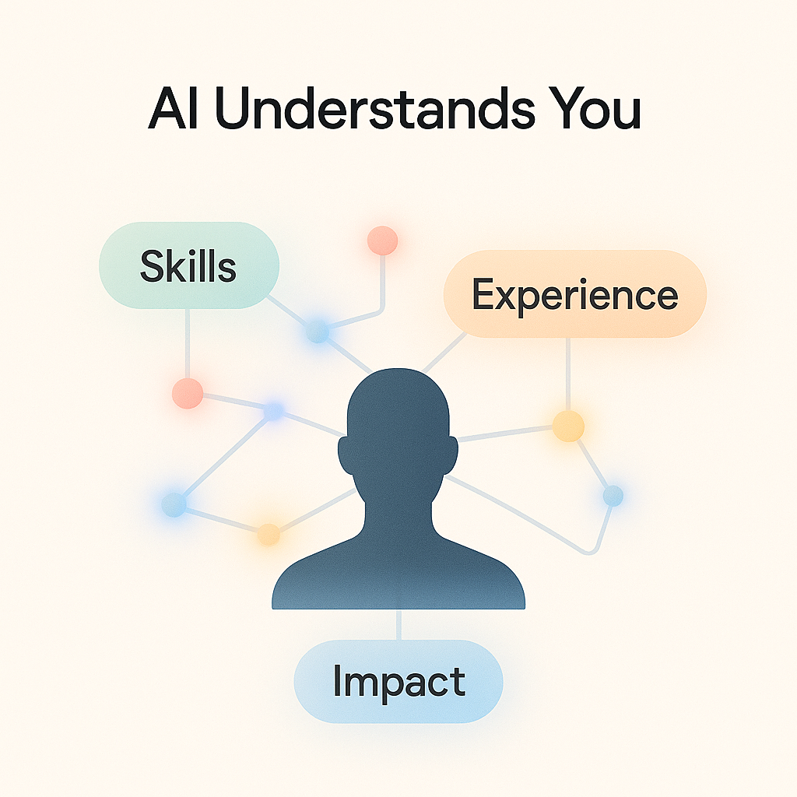
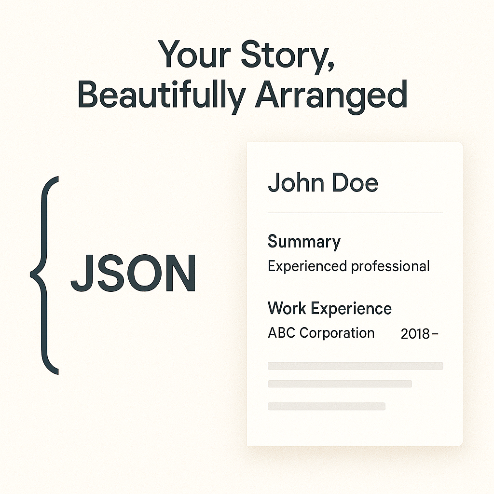
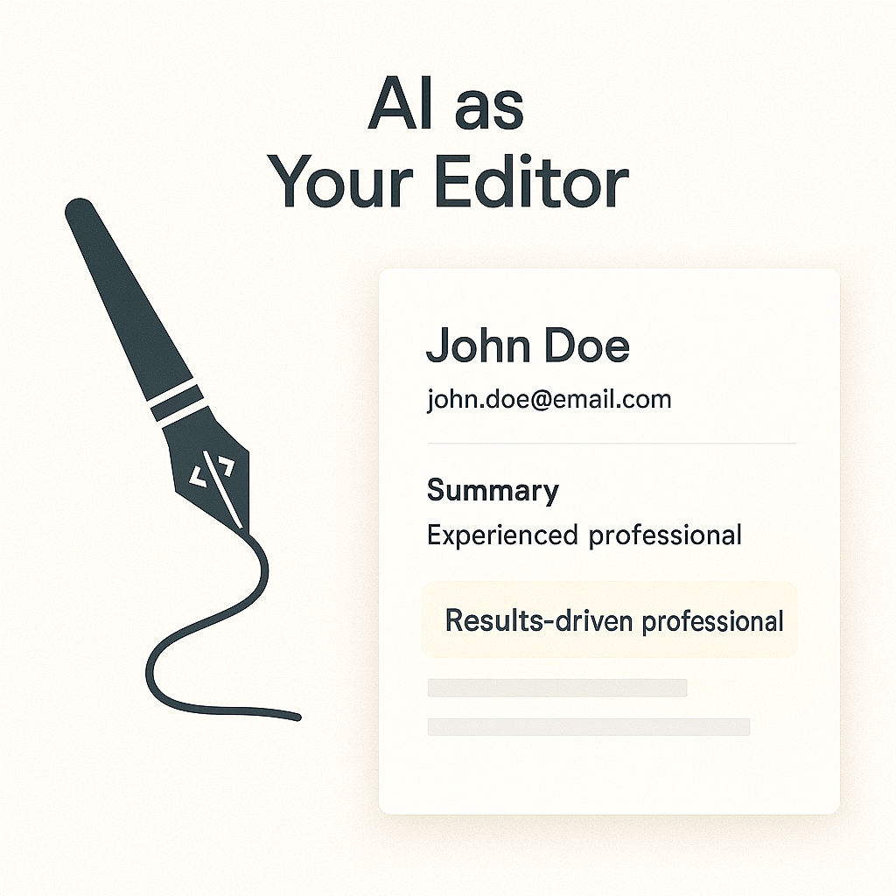
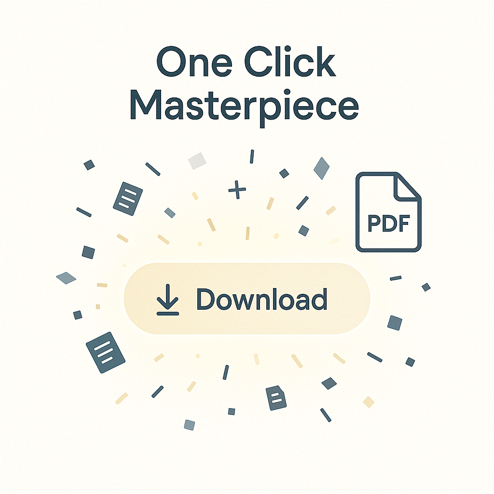
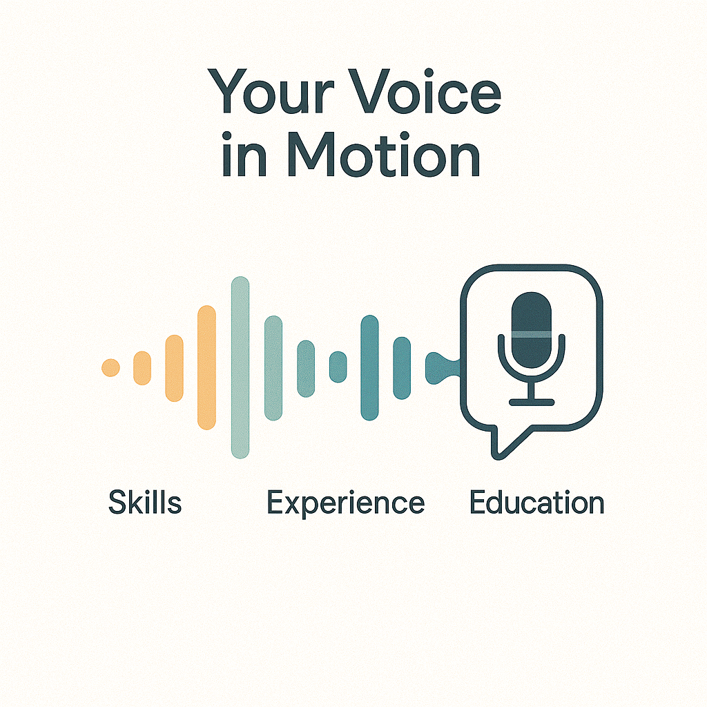
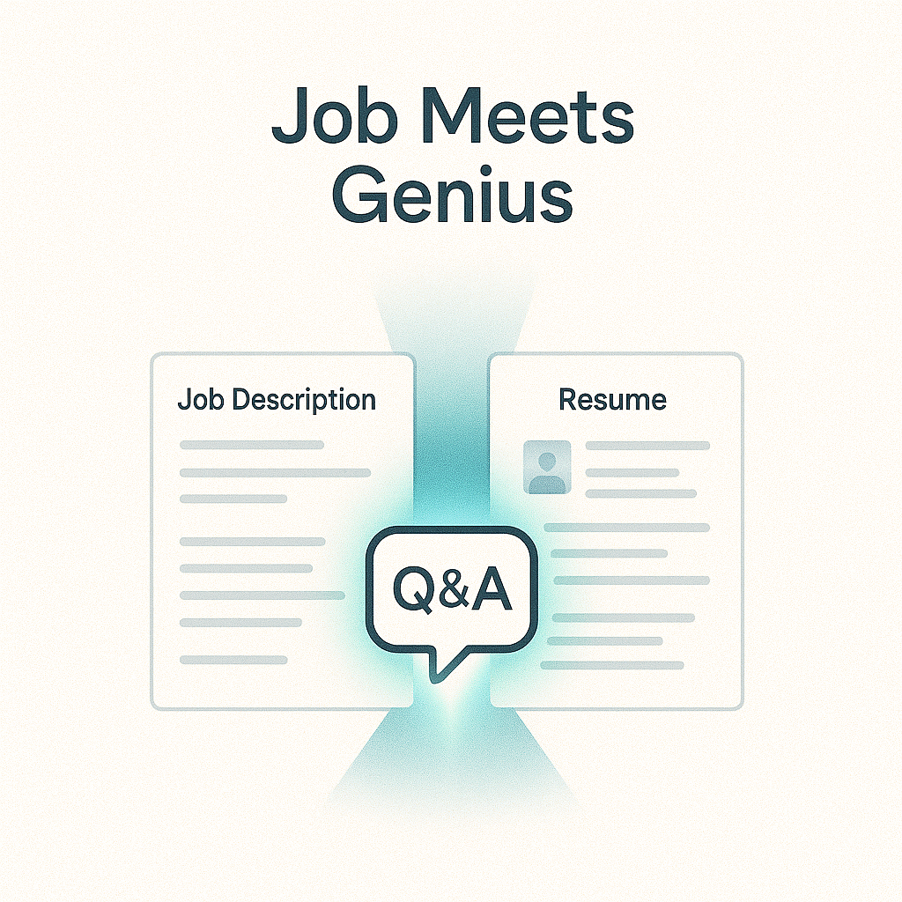
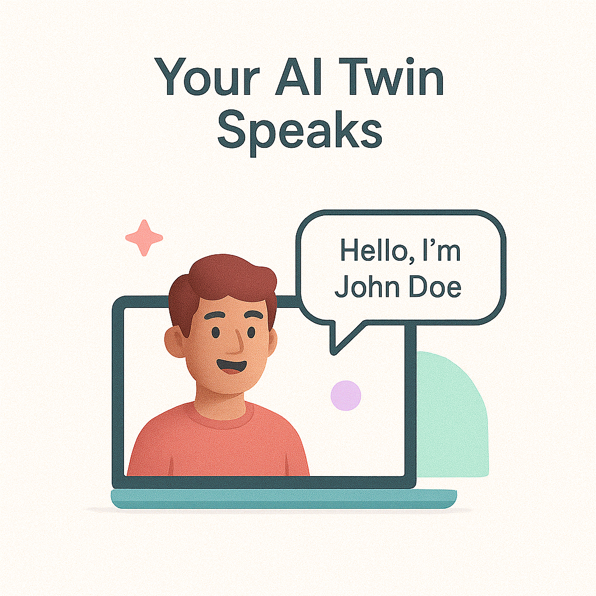

# Resume builder

#### Upload your old resume — and watch it evolve. Turn static text into living data. The system ingests your existing CV and prepares it for a new creative life, translating years of experience into structured information ready for intelligent redesign.

#### Once uploaded, artificial intelligence analyzes your content with surgical precision. It recognizes your strengths, patterns, and unique professional voice — then organizes everything into a coherent, data-rich structure that becomes the foundation for your new resume.

#### All extracted data instantly flows into a meticulously crafted template. Every section aligns perfectly — titles, timelines, and highlights balance for maximum readability. No manual formatting, no tedious alignment. Just artfully designed precision, powered by smart automation.

### The integrated AI editor becomes your silent collaborator. It proposes meaningful refinements — stronger verbs, clearer impact statements, more engaging phrasing. You stay in control, but now you have a professional writing assistant that truly gets context.

### When you’re satisfied, export your masterpiece instantly. High-resolution typography, perfect layout geometry, and consistent visual hierarchy — all compressed into a beautiful, print-ready PDF that carries your professional signature.

---

<h2 align="center">💎 Premium Features</h2>

Unlock next-level storytelling tools — from immersive self-presentations to creative AI companions.  
Each premium feature transforms your resume into an interactive experience.

---

<h3 align="left" style="color:#a68afc;">🎤 Your Voice in Motion</h3>

Go beyond paper. The system crafts an authentic introduction or even an elevator-pitch video script 
based on your data. In seconds, you have a concise, confident self-presentation — 
ready for networking events, video interviews, or portfolio reels.

  

---

  
<h3 style="color:#6eb9f7;">🤝 Job Meets Genius</h3>

Upload a target job description, and the AI builds a personalized presentation that bridges you and the role.  
It analyzes expectations, highlights alignment, and even drafts insightful interview questions — 
helping you step into every conversation fully prepared.

---

<h3 align="left" style="color:#6ed6a0;">🪄 Your AI Twin Speaks</h3>

Meet your digital twin. With a single click, you can generate a short, animated video introduction of yourself — 
voiced and scripted by AI. It’s not a formal presentation tool, but rather a playful feature for experimenting 
and entertaining yourself. Choose a random character, let the AI talk like you, and watch your professional story 
come to life in a fun, unexpected way.

  

---
